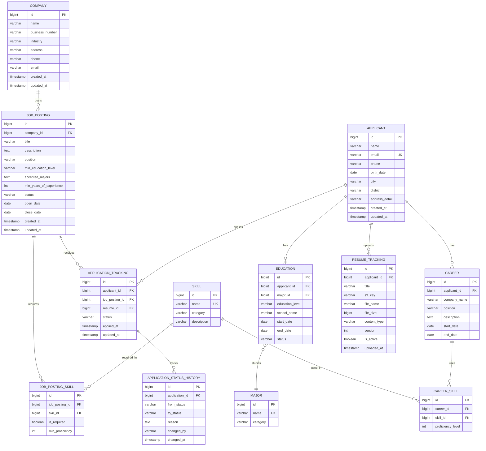

# 5. 데이터베이스 & ERD 설계

## 5.1 ERD 다이어그램 (Mermaid)



---

## 5.2 테이블 상세 설계

### 5.2.1 Company (기업)

| 컬럼명 | 타입 | 제약조건 | 설명 |
|--------|------|---------|------|
| id | BIGINT | PK, AUTO_INCREMENT | 기업 ID |
| name | VARCHAR(200) | NOT NULL | 기업명 |
| business_number | VARCHAR(20) | UNIQUE, NOT NULL | 사업자등록번호 |
| industry | VARCHAR(100) | | 업종 |
| address | VARCHAR(500) | | 주소 |
| phone | VARCHAR(20) | | 전화번호 |
| email | VARCHAR(100) | | 이메일 |
| created_at | TIMESTAMP | DEFAULT CURRENT_TIMESTAMP | 생성일시 |
| updated_at | TIMESTAMP | DEFAULT CURRENT_TIMESTAMP ON UPDATE | 수정일시 |

**인덱스:**
- `idx_company_business_number` ON (business_number)
- `idx_company_name` ON (name)

---

### 5.2.2 JobPosting (채용 공고)

| 컬럼명 | 타입 | 제약조건 | 설명 |
|--------|------|---------|------|
| id | BIGINT | PK, AUTO_INCREMENT | 공고 ID |
| company_id | BIGINT | FK, NOT NULL | 기업 ID |
| title | VARCHAR(200) | NOT NULL | 공고 제목 |
| description | TEXT | | 상세 설명 |
| position | VARCHAR(50) | NOT NULL | 포지션 (BACKEND, FRONTEND 등) |
| min_education_level | VARCHAR(20) | NOT NULL | 최소 학력 (BACHELOR, MASTER 등) |
| accepted_majors | TEXT | | 허용 전공 (JSON 배열) |
| min_years_of_experience | INT | DEFAULT 0 | 최소 경력 연차 |
| status | VARCHAR(20) | NOT NULL | 상태 (DRAFT, OPEN, CLOSED) |
| open_date | DATE | | 오픈일 |
| close_date | DATE | | 마감일 |
| created_at | TIMESTAMP | DEFAULT CURRENT_TIMESTAMP | 생성일시 |
| updated_at | TIMESTAMP | DEFAULT CURRENT_TIMESTAMP ON UPDATE | 수정일시 |

**인덱스:**
- `idx_jobposting_company` ON (company_id)
- `idx_jobposting_status` ON (status)
- `idx_jobposting_position` ON (position)
- `idx_jobposting_dates` ON (open_date, close_date)

**외래키:**
- `fk_jobposting_company` FOREIGN KEY (company_id) REFERENCES company(id)

---

### 5.2.3 Skill (기술)

| 컬럼명 | 타입 | 제약조건 | 설명 |
|--------|------|---------|------|
| id | BIGINT | PK, AUTO_INCREMENT | 스킬 ID |
| name | VARCHAR(100) | UNIQUE, NOT NULL | 스킬명 |
| category | VARCHAR(50) | | 카테고리 (LANGUAGE, FRAMEWORK, DATABASE 등) |
| description | TEXT | | 설명 |

**인덱스:**
- `idx_skill_name` ON (name)
- `idx_skill_category` ON (category)

---

### 5.2.4 JobPostingSkill (공고별 요구 기술)

| 컬럼명 | 타입 | 제약조건 | 설명 |
|--------|------|---------|------|
| id | BIGINT | PK, AUTO_INCREMENT | ID |
| job_posting_id | BIGINT | FK, NOT NULL | 공고 ID |
| skill_id | BIGINT | FK, NOT NULL | 스킬 ID |
| is_required | BOOLEAN | DEFAULT TRUE | 필수 여부 |
| min_proficiency | INT | | 최소 숙련도 (1-5) |

**인덱스:**
- `idx_jobposting_skill_posting` ON (job_posting_id)
- `idx_jobposting_skill_skill` ON (skill_id)

**외래키:**
- `fk_jobposting_skill_posting` FOREIGN KEY (job_posting_id) REFERENCES job_posting(id) ON DELETE CASCADE
- `fk_jobposting_skill_skill` FOREIGN KEY (skill_id) REFERENCES skill(id)

---

### 5.2.5 Applicant (지원자)

| 컬럼명 | 타입 | 제약조건 | 설명 |
|--------|------|---------|------|
| id | BIGINT | PK, AUTO_INCREMENT | 지원자 ID |
| name | VARCHAR(100) | NOT NULL | 이름 |
| email | VARCHAR(100) | UNIQUE, NOT NULL | 이메일 |
| phone | VARCHAR(20) | | 전화번호 |
| birth_date | DATE | | 생년월일 |
| city | VARCHAR(50) | | 도시 |
| district | VARCHAR(50) | | 구/군 |
| address_detail | VARCHAR(200) | | 상세 주소 |
| created_at | TIMESTAMP | DEFAULT CURRENT_TIMESTAMP | 생성일시 |
| updated_at | TIMESTAMP | DEFAULT CURRENT_TIMESTAMP ON UPDATE | 수정일시 |

**인덱스:**
- `idx_applicant_email` ON (email)
- `idx_applicant_name` ON (name)

---

### 5.2.6 Major (전공)

| 컬럼명 | 타입 | 제약조건 | 설명 |
|--------|------|---------|------|
| id | BIGINT | PK, AUTO_INCREMENT | 전공 ID |
| name | VARCHAR(100) | UNIQUE, NOT NULL | 전공명 |
| category | VARCHAR(50) | | 카테고리 (공학, 자연과학 등) |

**인덱스:**
- `idx_major_name` ON (name)

---

### 5.2.7 Education (학력)

| 컬럼명 | 타입 | 제약조건 | 설명 |
|--------|------|---------|------|
| id | BIGINT | PK, AUTO_INCREMENT | 학력 ID |
| applicant_id | BIGINT | FK, NOT NULL | 지원자 ID |
| major_id | BIGINT | FK | 전공 ID |
| education_level | VARCHAR(20) | NOT NULL | 학력 (HIGH_SCHOOL, BACHELOR 등) |
| school_name | VARCHAR(200) | NOT NULL | 학교명 |
| start_date | DATE | | 입학일 |
| end_date | DATE | | 졸업일 |
| status | VARCHAR(20) | | 상태 (GRADUATED, IN_PROGRESS, LEAVE) |

**인덱스:**
- `idx_education_applicant` ON (applicant_id)
- `idx_education_level` ON (education_level)
- `idx_education_major` ON (major_id)

**외래키:**
- `fk_education_applicant` FOREIGN KEY (applicant_id) REFERENCES applicant(id) ON DELETE CASCADE
- `fk_education_major` FOREIGN KEY (major_id) REFERENCES major(id)

---

### 5.2.8 Career (경력)

| 컬럼명 | 타입 | 제약조건 | 설명 |
|--------|------|---------|------|
| id | BIGINT | PK, AUTO_INCREMENT | 경력 ID |
| applicant_id | BIGINT | FK, NOT NULL | 지원자 ID |
| company_name | VARCHAR(200) | NOT NULL | 회사명 |
| position | VARCHAR(100) | | 직책 |
| description | TEXT | | 업무 설명 |
| start_date | DATE | NOT NULL | 시작일 |
| end_date | DATE | | 종료일 (NULL이면 재직중) |

**인덱스:**
- `idx_career_applicant` ON (applicant_id)
- `idx_career_dates` ON (start_date, end_date)

**외래키:**
- `fk_career_applicant` FOREIGN KEY (applicant_id) REFERENCES applicant(id) ON DELETE CASCADE

---

### 5.2.9 CareerSkill (경력 기술)

| 컬럼명 | 타입 | 제약조건 | 설명 |
|--------|------|---------|------|
| id | BIGINT | PK, AUTO_INCREMENT | ID |
| career_id | BIGINT | FK, NOT NULL | 경력 ID |
| skill_id | BIGINT | FK, NOT NULL | 스킬 ID |
| proficiency_level | INT | | 숙련도 (1-5) |

**인덱스:**
- `idx_career_skill_career` ON (career_id)
- `idx_career_skill_skill` ON (skill_id)

**외래키:**
- `fk_career_skill_career` FOREIGN KEY (career_id) REFERENCES career(id) ON DELETE CASCADE
- `fk_career_skill_skill` FOREIGN KEY (skill_id) REFERENCES skill(id)

---

### 5.2.10 ResumeTracking (이력서 버전 관리)

| 컬럼명 | 타입 | 제약조건 | 설명 |
|--------|------|---------|------|
| id | BIGINT | PK, AUTO_INCREMENT | 이력서 ID |
| applicant_id | BIGINT | FK, NOT NULL | 지원자 ID |
| title | VARCHAR(200) | | 이력서 제목 |
| s3_key | VARCHAR(500) | NOT NULL | S3 파일 경로 |
| file_name | VARCHAR(200) | NOT NULL | 원본 파일명 |
| file_size | BIGINT | | 파일 크기 (bytes) |
| content_type | VARCHAR(100) | | MIME 타입 |
| version | INT | DEFAULT 1 | 버전 번호 |
| is_active | BOOLEAN | DEFAULT TRUE | 활성 여부 |
| uploaded_at | TIMESTAMP | DEFAULT CURRENT_TIMESTAMP | 업로드일시 |

**인덱스:**
- `idx_resume_applicant` ON (applicant_id)
- `idx_resume_active` ON (applicant_id, is_active)

**외래키:**
- `fk_resume_applicant` FOREIGN KEY (applicant_id) REFERENCES applicant(id) ON DELETE CASCADE

---

### 5.2.11 ApplicationTracking (지원 추적)

| 컬럼명 | 타입 | 제약조건 | 설명 |
|--------|------|---------|------|
| id | BIGINT | PK, AUTO_INCREMENT | 지원 ID |
| applicant_id | BIGINT | FK, NOT NULL | 지원자 ID |
| job_posting_id | BIGINT | FK, NOT NULL | 공고 ID |
| resume_id | BIGINT | FK, NOT NULL | 이력서 ID |
| status | VARCHAR(20) | NOT NULL | 상태 (APPLIED, DOCUMENT_PASS 등) |
| applied_at | TIMESTAMP | DEFAULT CURRENT_TIMESTAMP | 지원일시 |
| updated_at | TIMESTAMP | DEFAULT CURRENT_TIMESTAMP ON UPDATE | 수정일시 |

**인덱스:**
- `idx_application_applicant` ON (applicant_id)
- `idx_application_posting` ON (job_posting_id)
- `idx_application_status` ON (status)
- `idx_application_applied_at` ON (applied_at)

**유니크 제약:**
- `uk_application_applicant_posting` UNIQUE (applicant_id, job_posting_id)

**외래키:**
- `fk_application_applicant` FOREIGN KEY (applicant_id) REFERENCES applicant(id)
- `fk_application_posting` FOREIGN KEY (job_posting_id) REFERENCES job_posting(id)
- `fk_application_resume` FOREIGN KEY (resume_id) REFERENCES resume_tracking(id)

---

### 5.2.12 ApplicationStatusHistory (지원 상태 이력)

| 컬럼명 | 타입 | 제약조건 | 설명 |
|--------|------|---------|------|
| id | BIGINT | PK, AUTO_INCREMENT | 이력 ID |
| application_id | BIGINT | FK, NOT NULL | 지원 ID |
| from_status | VARCHAR(20) | | 이전 상태 |
| to_status | VARCHAR(20) | NOT NULL | 변경 상태 |
| reason | TEXT | | 변경 사유 |
| changed_by | VARCHAR(100) | | 변경자 (HR 담당자 ID) |
| changed_at | TIMESTAMP | DEFAULT CURRENT_TIMESTAMP | 변경일시 |

**인덱스:**
- `idx_status_history_application` ON (application_id)
- `idx_status_history_changed_at` ON (changed_at)

**외래키:**
- `fk_status_history_application` FOREIGN KEY (application_id) REFERENCES application_tracking(id) ON DELETE CASCADE

---

## 5.3 정규화 설명

### 제1정규형 (1NF)
- 모든 컬럼은 원자값(Atomic Value)을 가짐
- 예: `accepted_majors`는 JSON 배열로 저장하지만, 검색 시 별도 테이블로 정규화 가능

### 제2정규형 (2NF)
- 부분 함수 종속 제거
- 예: `CareerSkill`은 `career_id`와 `skill_id` 복합키로 식별되며, 모든 속성이 전체 키에 종속

### 제3정규형 (3NF)
- 이행 함수 종속 제거
- 예: `Education`에서 `major_id`를 통해 `Major` 테이블 참조 (전공명을 직접 저장하지 않음)

### 역정규화 고려 사항
- `JobPosting.accepted_majors`: JSON 배열로 저장 (검색 빈도 낮음)
- 통계 테이블: 별도 집계 테이블 생성 (읽기 성능 최적화)

---

## 5.4 인덱스 전략

### 검색 조건 기반 인덱스

| 검색 조건 | 인덱스 | 테이블 |
|----------|--------|--------|
| 학력 필터 | `idx_education_level` | education |
| 전공 필터 | `idx_education_major` | education |
| 경력 연차 계산 | `idx_career_dates` | career |
| 스킬 필터 | `idx_career_skill_skill` | career_skill |
| 지원 상태 필터 | `idx_application_status` | application_tracking |
| 공고별 지원자 조회 | `idx_application_posting` | application_tracking |
| 지원자별 지원 내역 | `idx_application_applicant` | application_tracking |

### 복합 인덱스

```sql
-- 활성 이력서 조회 (지원자별 최신 활성 이력서)
CREATE INDEX idx_resume_active ON resume_tracking(applicant_id, is_active);

-- 공고 검색 (상태 + 마감일)
CREATE INDEX idx_jobposting_status_dates ON job_posting(status, close_date);

-- 지원 내역 검색 (공고 + 상태)
CREATE INDEX idx_application_posting_status ON application_tracking(job_posting_id, status);
```

### 인덱스 사용 예시

```sql
-- 인덱스 활용: idx_application_posting_status
SELECT * FROM application_tracking
WHERE job_posting_id = 1
  AND status = 'DOCUMENT_PASS';

-- 인덱스 활용: idx_education_level, idx_education_major
SELECT a.* FROM applicant a
INNER JOIN education e ON a.id = e.applicant_id
WHERE e.education_level IN ('BACHELOR', 'MASTER', 'DOCTORATE')
  AND e.major_id IN (1, 2, 3);
```

---

## 5.5 데이터 무결성 제약

### 외래키 제약 (Referential Integrity)
- `ON DELETE CASCADE`: 부모 삭제 시 자식도 삭제 (education, career, career_skill 등)
- `ON DELETE RESTRICT`: 부모 삭제 방지 (application_tracking → applicant)

### 체크 제약 (Check Constraints)

```sql
-- 경력 종료일은 시작일보다 이후
ALTER TABLE career
ADD CONSTRAINT chk_career_dates
CHECK (end_date IS NULL OR end_date >= start_date);

-- 최소 경력 연차는 0 이상
ALTER TABLE job_posting
ADD CONSTRAINT chk_min_experience
CHECK (min_years_of_experience >= 0);

-- 숙련도는 1-5 범위
ALTER TABLE career_skill
ADD CONSTRAINT chk_proficiency_level
CHECK (proficiency_level BETWEEN 1 AND 5);

-- 파일 크기는 10MB 이하
ALTER TABLE resume_tracking
ADD CONSTRAINT chk_file_size
CHECK (file_size <= 10485760);
```

### 유니크 제약 (Unique Constraints)

```sql
-- 지원자는 같은 공고에 1번만 지원 가능
ALTER TABLE application_tracking
ADD CONSTRAINT uk_application_applicant_posting
UNIQUE (applicant_id, job_posting_id);

-- 지원자당 1개의 활성 이력서만 허용 (트리거로 구현)
CREATE TRIGGER trg_resume_active_check
BEFORE INSERT ON resume_tracking
FOR EACH ROW
BEGIN
    IF NEW.is_active = TRUE THEN
        UPDATE resume_tracking
        SET is_active = FALSE
        WHERE applicant_id = NEW.applicant_id
          AND is_active = TRUE;
    END IF;
END;
```

---

## 5.6 ERD 텍스트 표현

```
[Company] 1 ----< * [JobPosting]
[JobPosting] 1 ----< * [JobPostingSkill] >---- * [Skill]
[JobPosting] 1 ----< * [ApplicationTracking]

[Applicant] 1 ----< * [Education] >---- * [Major]
[Applicant] 1 ----< * [Career]
[Career] 1 ----< * [CareerSkill] >---- * [Skill]
[Applicant] 1 ----< * [ResumeTracking]
[Applicant] 1 ----< * [ApplicationTracking]

[ApplicationTracking] 1 ----< * [ApplicationStatusHistory]
```

**관계 설명:**
- `1 ----< *`: 1:N 관계
- `>---- *`: N:M 관계 (중간 테이블 존재)
