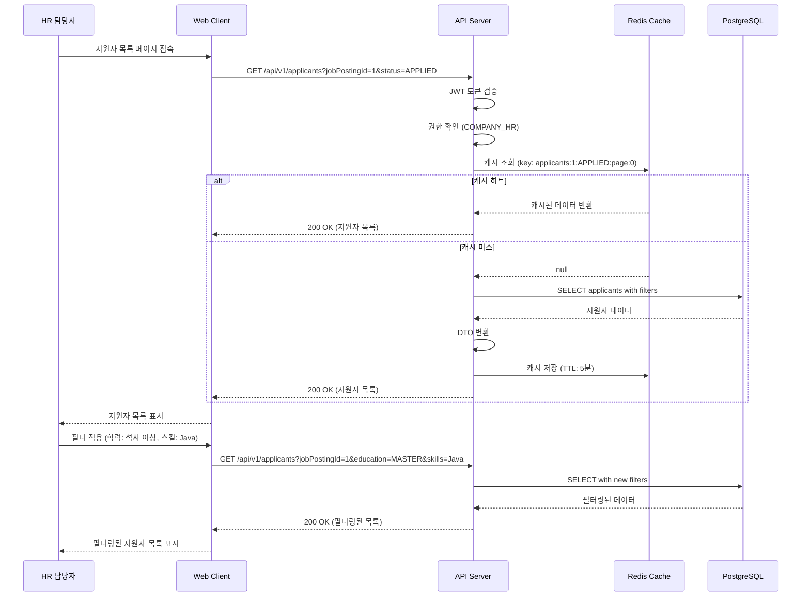
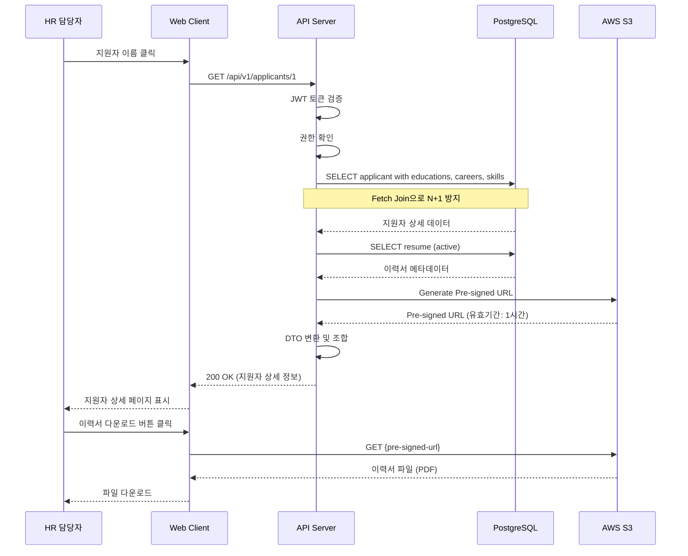
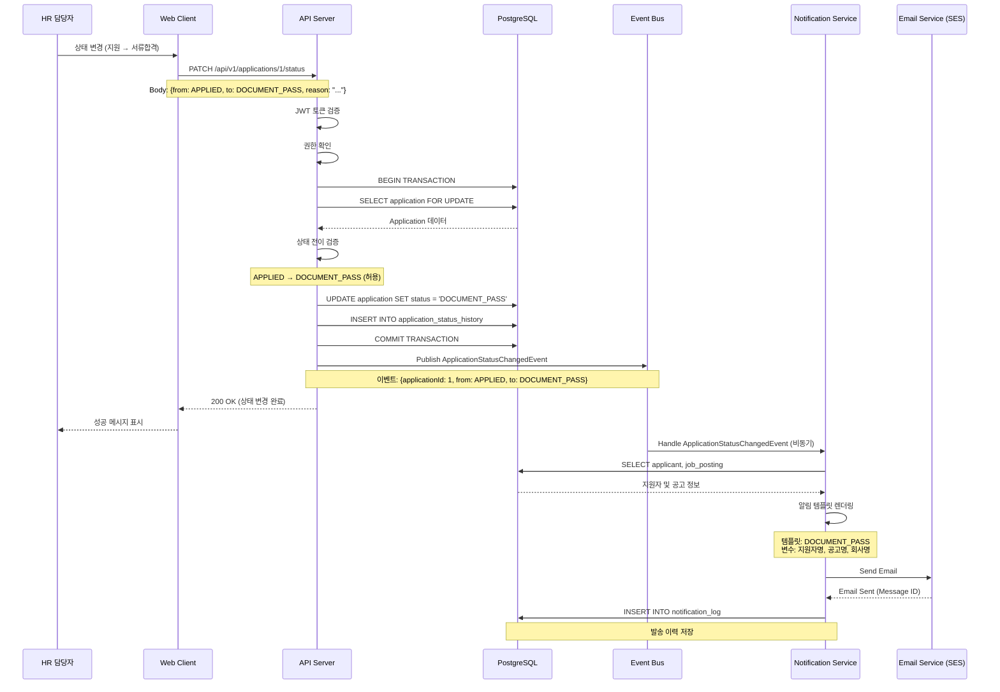
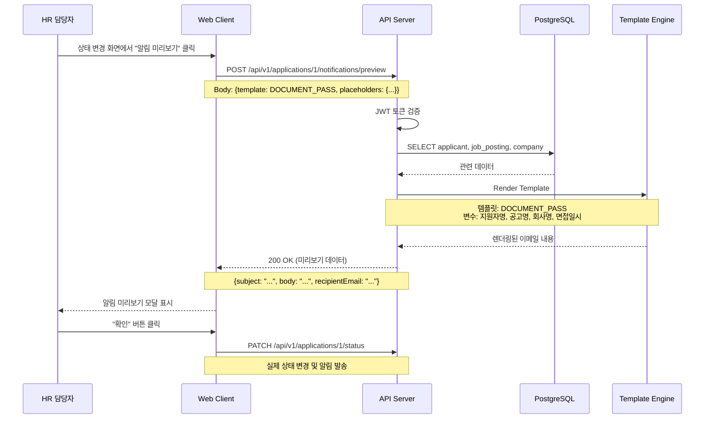
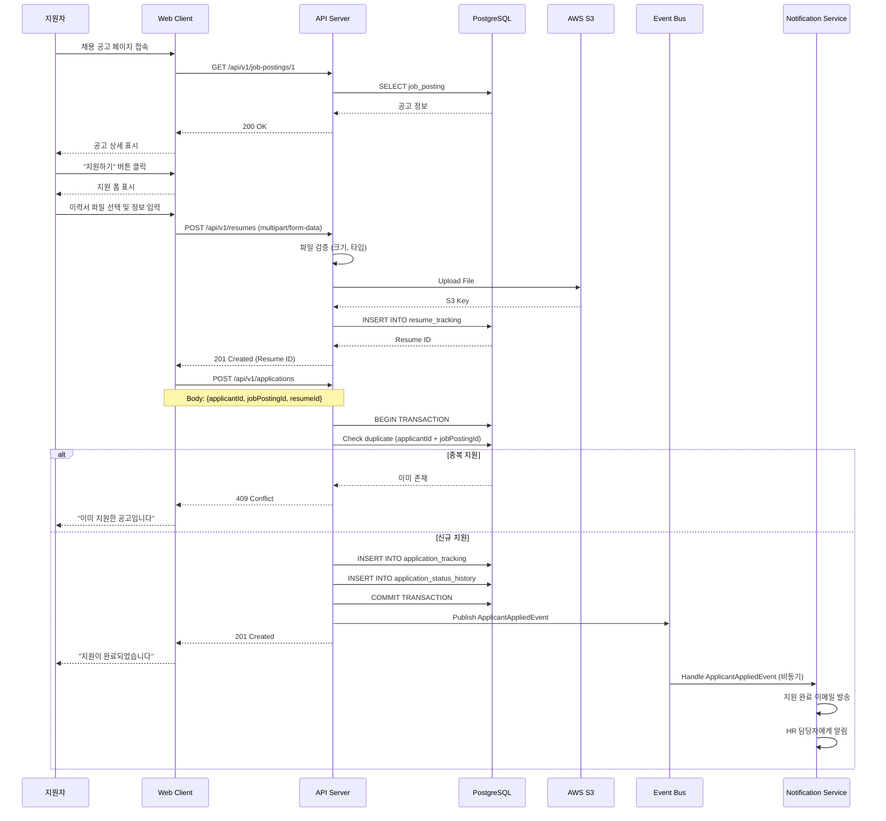
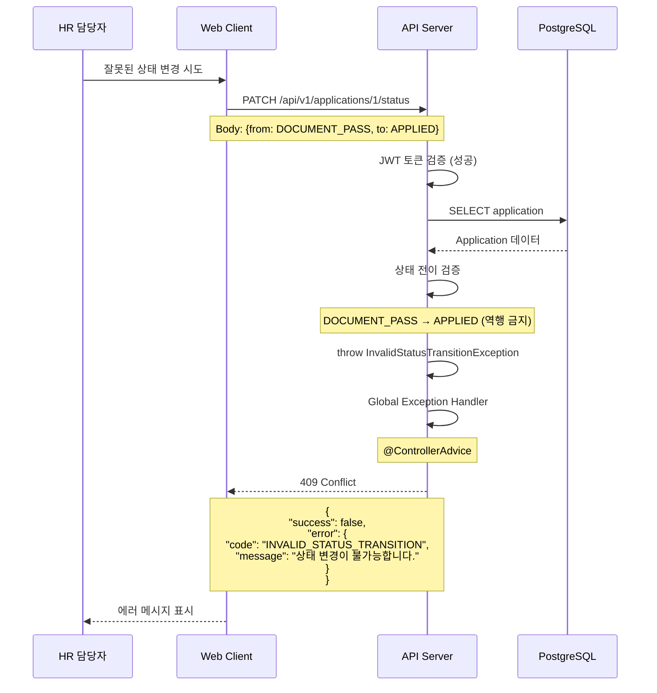

# 10. 시퀀스 다이어그램

## 10.1 지원자 목록 조회 및 필터 적용



---

## 10.2 지원자 상세 페이지 열기



---

## 10.3 지원 상태 변경 및 알림 발송



---

## 10.4 알림 템플릿 미리보기



---

## 10.5 지원자 지원 프로세스



---

## 10.6 에러 처리 흐름



---

## 10.7 텍스트 기반 시퀀스 (간단 버전)

### 시나리오 1: 지원자 목록 조회
```
1. HR 담당자가 지원자 목록 페이지 접속
2. Web Client가 API Server에 GET /api/v1/applicants 요청
3. API Server가 JWT 토큰 검증 및 권한 확인
4. Redis Cache 조회
   - 캐시 히트: 캐시된 데이터 반환
   - 캐시 미스: PostgreSQL 조회 → 캐시 저장 → 데이터 반환
5. Web Client가 지원자 목록 표시
```

### 시나리오 2: 상태 변경
```
1. HR 담당자가 상태 변경 (지원 → 서류합격)
2. Web Client가 API Server에 PATCH /api/v1/applications/1/status 요청
3. API Server가 트랜잭션 시작
4. Application 조회 및 상태 전이 검증
5. Application 상태 업데이트 및 이력 기록
6. 트랜잭션 커밋
7. ApplicationStatusChangedEvent 발행 (비동기)
8. Notification Service가 이벤트 처리 및 이메일 발송
```

### 시나리오 3: 알림 미리보기
```
1. HR 담당자가 "알림 미리보기" 클릭
2. Web Client가 API Server에 POST /api/v1/applications/1/notifications/preview 요청
3. API Server가 지원자, 공고, 회사 정보 조회
4. Template Engine이 알림 템플릿 렌더링
5. Web Client가 미리보기 모달 표시
6. HR 담당자가 확인 후 실제 상태 변경 진행
```
