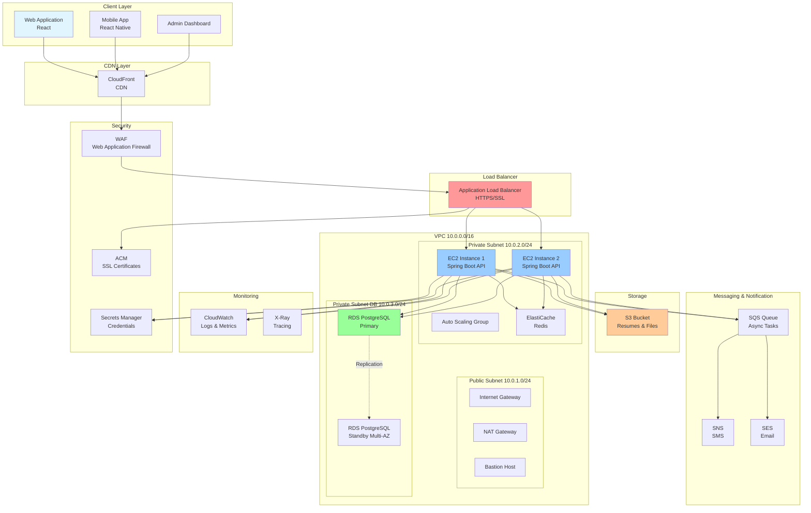

# AWS 아키텍처 다이어그램

## 전체 아키텍처 (Mermaid)



---

## VPC 네트워크 구조

```
┌─────────────────────────────────────────────────────────────────┐
│                         VPC (10.0.0.0/16)                        │
│                                                                   │
│  ┌────────────────────────────────────────────────────────────┐ │
│  │         Public Subnet (10.0.1.0/24) - AZ-A                 │ │
│  │  ┌──────────────┐  ┌──────────────┐  ┌──────────────┐    │ │
│  │  │   Internet   │  │     NAT      │  │   Bastion    │    │ │
│  │  │   Gateway    │  │   Gateway    │  │     Host     │    │ │
│  │  └──────────────┘  └──────────────┘  └──────────────┘    │ │
│  │                                                             │ │
│  │  ┌──────────────────────────────────────────────────────┐ │ │
│  │  │        Application Load Balancer (ALB)               │ │ │
│  │  └──────────────────────────────────────────────────────┘ │ │
│  └────────────────────────────────────────────────────────────┘ │
│                                                                   │
│  ┌────────────────────────────────────────────────────────────┐ │
│  │        Private Subnet (10.0.2.0/24) - AZ-A                 │ │
│  │  ┌──────────────┐  ┌──────────────┐  ┌──────────────┐    │ │
│  │  │  EC2 API-1   │  │  EC2 API-2   │  │ ElastiCache  │    │ │
│  │  │ Spring Boot  │  │ Spring Boot  │  │    Redis     │    │ │
│  │  └──────────────┘  └──────────────┘  └──────────────┘    │ │
│  └────────────────────────────────────────────────────────────┘ │
│                                                                   │
│  ┌────────────────────────────────────────────────────────────┐ │
│  │      Private Subnet DB (10.0.3.0/24) - AZ-A                │ │
│  │  ┌──────────────┐                                          │ │
│  │  │     RDS      │                                          │ │
│  │  │  PostgreSQL  │                                          │ │
│  │  │   Primary    │                                          │ │
│  │  └──────────────┘                                          │ │
│  └────────────────────────────────────────────────────────────┘ │
│                                                                   │
│  ┌────────────────────────────────────────────────────────────┐ │
│  │      Private Subnet DB (10.0.4.0/24) - AZ-B (Multi-AZ)     │ │
│  │  ┌──────────────┐                                          │ │
│  │  │     RDS      │                                          │ │
│  │  │  PostgreSQL  │                                          │ │
│  │  │   Standby    │                                          │ │
│  │  └──────────────┘                                          │ │
│  └────────────────────────────────────────────────────────────┘ │
│                                                                   │
└─────────────────────────────────────────────────────────────────┘

External Services:
┌──────────────┐  ┌──────────────┐  ┌──────────────┐
│      S3      │  │     SQS      │  │  CloudWatch  │
│   Bucket     │  │    Queue     │  │   Logs       │
└──────────────┘  └──────────────┘  └──────────────┘
```

---

## 데이터 흐름

```
1. 사용자 요청
   User → CloudFront → WAF → ALB → EC2 (API Server)

2. 데이터 조회
   EC2 → Redis (Cache Hit) → Response
   EC2 → PostgreSQL (Cache Miss) → Redis → Response

3. 파일 업로드
   User → EC2 → S3 → Pre-signed URL → User

4. 비동기 작업
   EC2 → SQS → Lambda/Worker → SES/SNS → User

5. 모니터링
   EC2 → CloudWatch Logs
   EC2 → CloudWatch Metrics
   EC2 → X-Ray (Tracing)
```

---

## Security Group 규칙

```
┌─────────────────────────────────────────────────────────────┐
│ ALB Security Group                                          │
├─────────────────────────────────────────────────────────────┤
│ Inbound:                                                    │
│   - Port 443 (HTTPS) from 0.0.0.0/0                        │
│ Outbound:                                                   │
│   - Port 8080 to EC2 Security Group                        │
└─────────────────────────────────────────────────────────────┘

┌─────────────────────────────────────────────────────────────┐
│ EC2 Security Group                                          │
├─────────────────────────────────────────────────────────────┤
│ Inbound:                                                    │
│   - Port 8080 from ALB Security Group                      │
│   - Port 22 (SSH) from Bastion Security Group              │
│ Outbound:                                                   │
│   - Port 5432 to RDS Security Group                        │
│   - Port 6379 to Redis Security Group                      │
│   - Port 443 to 0.0.0.0/0 (AWS API, S3)                   │
└─────────────────────────────────────────────────────────────┘

┌─────────────────────────────────────────────────────────────┐
│ RDS Security Group                                          │
├─────────────────────────────────────────────────────────────┤
│ Inbound:                                                    │
│   - Port 5432 from EC2 Security Group                      │
│ Outbound:                                                   │
│   - None                                                    │
└─────────────────────────────────────────────────────────────┘

┌─────────────────────────────────────────────────────────────┐
│ Redis Security Group                                        │
├─────────────────────────────────────────────────────────────┤
│ Inbound:                                                    │
│   - Port 6379 from EC2 Security Group                      │
│ Outbound:                                                   │
│   - None                                                    │
└─────────────────────────────────────────────────────────────┘
```

---

## 배포 아키텍처 (Blue-Green)

```
┌─────────────────────────────────────────────────────────────┐
│                    Application Load Balancer                │
│                                                              │
│  ┌────────────────────┐         ┌────────────────────┐     │
│  │  Target Group A    │         │  Target Group B    │     │
│  │  (Blue - Current)  │         │  (Green - New)     │     │
│  └────────────────────┘         └────────────────────┘     │
└─────────────────────────────────────────────────────────────┘
           │                                 │
           ▼                                 ▼
  ┌─────────────────┐              ┌─────────────────┐
  │  EC2 Instance 1 │              │  EC2 Instance 3 │
  │  (v1.0.0)       │              │  (v1.1.0)       │
  └─────────────────┘              └─────────────────┘
  ┌─────────────────┐              ┌─────────────────┐
  │  EC2 Instance 2 │              │  EC2 Instance 4 │
  │  (v1.0.0)       │              │  (v1.1.0)       │
  └─────────────────┘              └─────────────────┘

배포 프로세스:
1. Green 환경에 새 버전 배포
2. Health Check 통과 확인
3. ALB 트래픽을 Blue → Green으로 전환
4. 문제 발생 시 즉시 Blue로 롤백
5. Green 안정화 후 Blue 환경 제거
```
